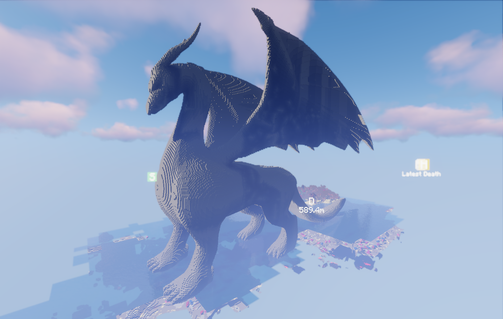
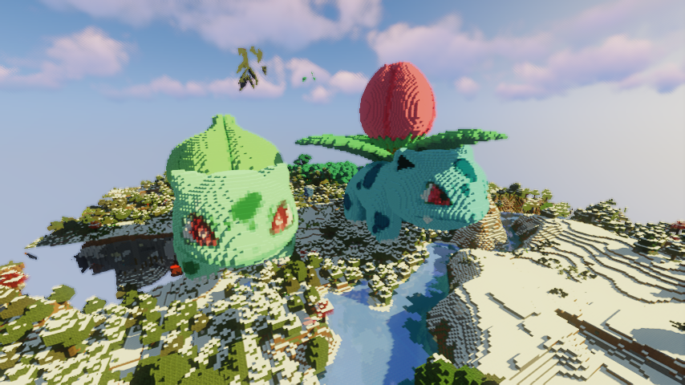
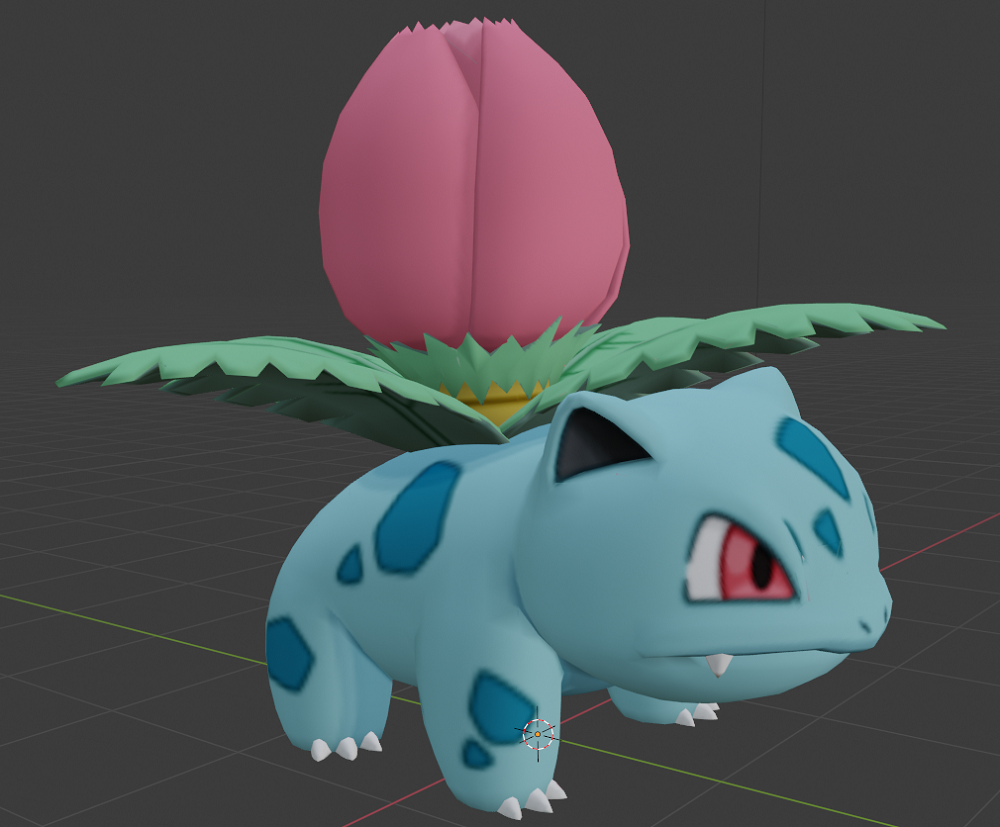
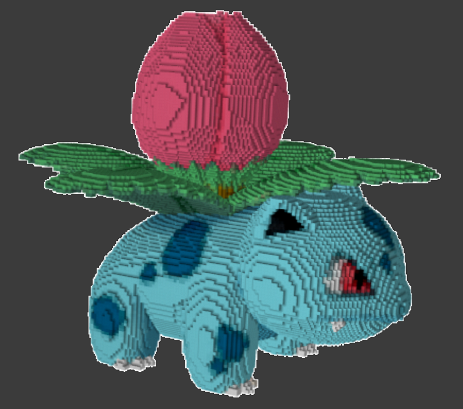
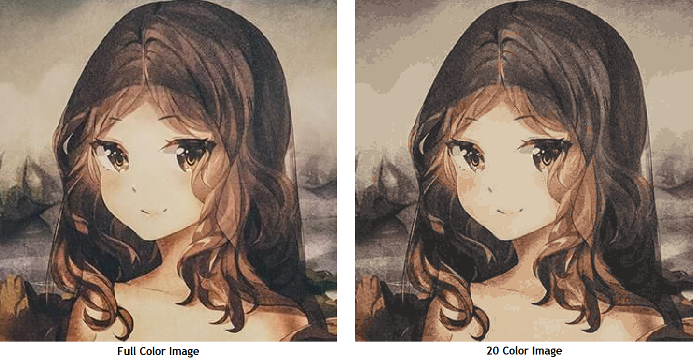
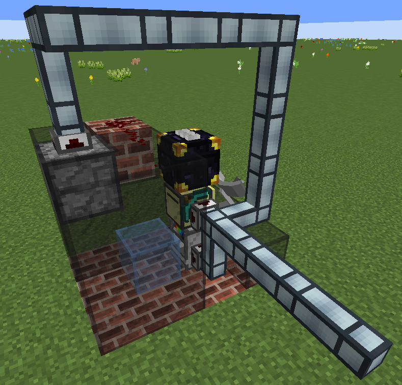

This repository contains the code used to program ComputerCraft turtles to build giant models in minecraft. Below are some examples:

 

We use the [Cubic Chunks Mod](https://www.curseforge.com/minecraft/mc-mods/opencubicchunks) so that 3D models of any size can be built in the minecraft world. We also use the [OpenBlocks Mod](https://www.curseforge.com/minecraft/mc-mods/openblocks) to allow for any color to be used to texture the models. Given an 3D model, the following is the process we use to convert it to a voxelized 3D model in a minecraft world:

# Voxelization #

* Use a [voxelizer](https://drububu.com/miscellaneous/voxelizer/?out=obj) to convert the 3D model to voxels.

  

During this step, the model is transformed so that it can be represented as a .txt file. Each line of the .txt file represents a single voxel and has the following format:
`voxel_x_location, voxel_y_location, voxel_z_location, voxel_color`

# Color Quantization #

The goal of this step is to reduce the number of colors in order to simplify the paint making process (elaborated below). If done carefully, the model with fewer colors will look almost the same as the full color model. Consider the following example:



The code used to reduce the number of colors is shown below. The main idea is to use KMeans to identify colors that are important in the picture, and replace each pixel with the closest cluster center/color. We represent colors with RGB tuples, and use Euclidian distance as our distance metric:

```
"""
This function reduces the number of colors in an image. It takes in 2 arguments:
img: The image to pixelate
num_colors: The number of colors to use when pixelating
"""
def reduce_colors(img, num_colors):

    img = img[:,:,:3] # extract RGB channels only. Ignore alpha if it exists

    colors = np.reshape(img, (-1,3))
    kmeans = KMeans(n_clusters=num_colors, random_state=0).fit(colors)
    cols = kmeans.cluster_centers_

    # Loop through the image and assign each color to the closest color in the
    # color palette.
    for i in range(len(img)):
        for j in range(len(img[0])):
            img[i,j,:] = min(cols, key = lambda x : dist(x, img[i,j,:]))

    return img
```

# Generate the Path #
Run [a pathmaking algorithm](makeFullColorModel.py), which generates a file that lets the ComputerCraft turtles know the order of blocks to visit, as well as which color to paint each block. We implement the following greedy algorithm:

* Set the start location to be 0,0,0
* For each layer in the model (by layer we mean a XZ cross section):
    * For i in range(number of voxels in current layer):
        * Sort the remaining voxels by manhattan distance
        * Set the location to be the closest voxel
        * Remove this voxel from the list of remaining voxel
        * Add this voxel as the next destination on the grand path the turtle is to traverse

This is a greedy algorithm and will not always find the optimal path. The runtime is `O(mn^2log(n))` where `m` is the height of the model, in voxels, and `n` is maximum number of voxels in a layer. Thus, the algorithm can be very slow when asked to generate paths for models with thick cross sections.

Put GIF of turtle working on a layer here

# Transfer the Model to ComputerCraft Turtles #
To transfer the generated path to the turtles in the minecraft world, we first have to run the [server](server.py). Then, we can make use of the HTTP API built into ComputerCraft turtles to send a HTTP request to our server, which will serve the .txt file representing the model.

# Paint Making Process #
To make the required paintbrushes needed to texture the model in the minecraft world, we make use of the paint machine pictured below:



The paint making process is quite involved, making use of a main computercraft turtle controller as well as the nanobot extension provided by the [PeripheralsPlusOne Mod](https://peripheralsplusone.readthedocs.io/en/latest/)


# Orientation and Placement #
* Finally, start the building turtle at the desired location


