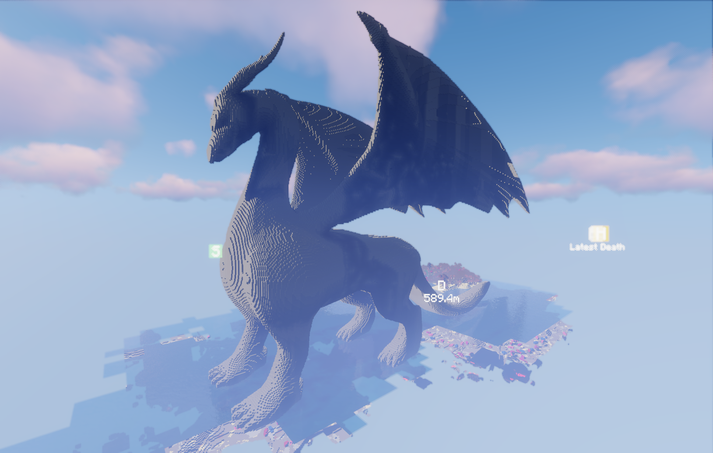
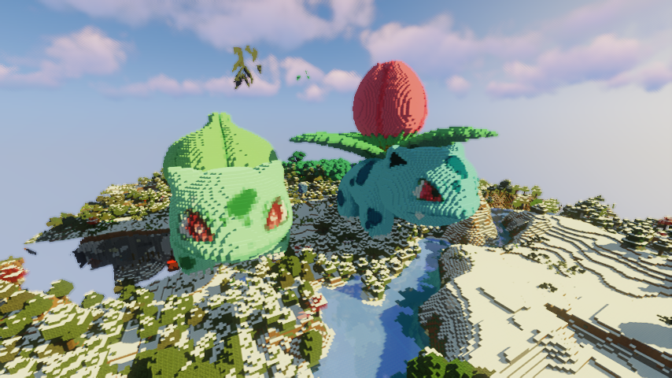

This repository contains the code used to program ComputerCraft turtles to build giant models in minecraft. Below are some examples:

We use the [Cubic Chunks Mod](https://www.curseforge.com/minecraft/mc-mods/opencubicchunks) so that 3D models of any size can be built in the minecraft world. We also use the [OpenBlocks Mod](https://www.curseforge.com/minecraft/mc-mods/openblocks) to allow for any color to be used to texture the models. Given an 3D model, the following is the process we use to convert it to a voxelized 3D model in a minecraft world:

* Use a [voxelizer](https://drububu.com/miscellaneous/voxelizer/?out=obj) to convert the 3D model to voxels.
* Reduce the number of colors using a color quantization algorithm (we use KMeans), in order to simplify the paint making process.
* Run [a pathmaking algorithm](makeFullColorModel.py), which generates a file that lets the ComputerCraft turtles know the order of blocks to visit, as well as which color to paint each block.
* Run the [server](server.py)
* Have the turtles in the minecraft world request the generated model file from the server.
* Make the required paintbrushes needed to texture the model in the minecraft world.
* Start the Refill Bots
* Finally, start the building turtle at the desired location

