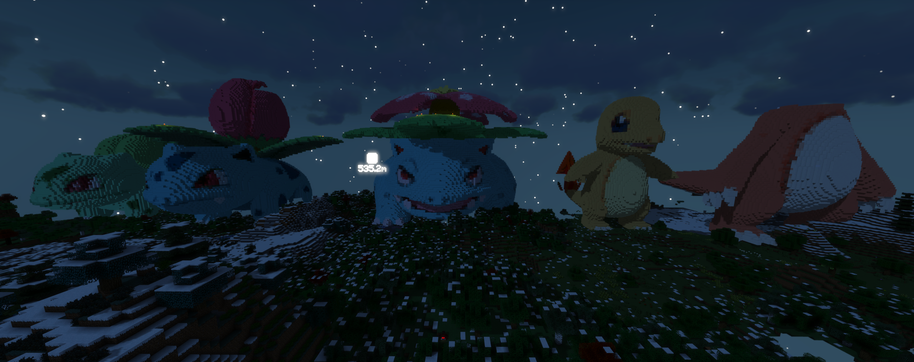

This repository contains the code used to program ComputerCraft turtles to build giant models in minecraft. Below are some examples:

We use the [Cubic Chunks Mod](https://www.curseforge.com/minecraft/mc-mods/opencubicchunks) so that 3D models of any size can be built in the minecraft world. We also use the [OpenBlocks Mod](https://www.curseforge.com/minecraft/mc-mods/openblocks) to allow for any color to be used to texture the models. Given an 3D model, the following is the process we use to convert it to a voxelized 3D model in a minecraft world:

# Voxelization #

* Use a [voxelizer](https://drububu.com/miscellaneous/voxelizer/?out=obj) to convert the 3D model to voxels.

  

During this step, the model is transformed so that it can be represented as a .txt file. Each line of the .txt file represents a single voxel and has the following format:
`voxel_x_location, voxel_y_location, voxel_z_location, voxel_color`

# Color Quantization #

The goal of this step is to reduce the number of colors in order to simplify the paint making process (elaborated below). If done carefully, the model with fewer colors will look almost the same as the full color model. Consider the following example:

# Generate the Path #
* Run [a pathmaking algorithm](makeFullColorModel.py), which generates a file that lets the ComputerCraft turtles know the order of blocks to visit, as well as which color to paint each block.

# Transfer the Model to ComputerCraft Turtles #
* Run the [server](server.py)
* Have the turtles in the minecraft world request the generated model file from the server.

# Paint Making Process #
* Make the required paintbrushes needed to texture the model in the minecraft world.
* Start the Refill Bots

# Orientation and Placement #
* Finally, start the building turtle at the desired location

